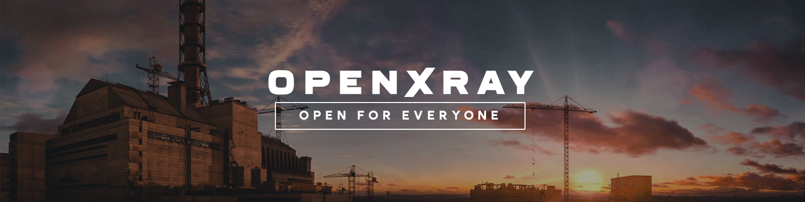

OpenXRay
==========================
OpenXRay is an improved version of the X-Ray Engine, the game engine used in the world-famous S.T.A.L.K.E.R. game series by GSC Game World.

### Supported games
|Call of Pripyat|Clear Sky|Shadow of Chernobyl|
|---|---|---|
|Yes|Release Candidate (see [#382](https://github.com/OpenXRay/xray-16/issues/382))| **Not supported** yet (see [#392](https://github.com/OpenXRay/xray-16/issues/392))|

### Build status

|CI|Platform|Compiler|Configurations|Platforms|Status|
|---|---|---|---|---|---|
|AppVeyor|Windows, Linux|MSVC, GCC|Debug, Mixed, Release, Release Master Gold|x64, x86||
|Travis|Linux|GCC|Debug, Release|ARM64, x64, x86||
|GitHub Actions|Windows, Linux|MSVC, GCC|Debug, Mixed, Release, Release Master Gold|x64, x86|

### Contributing
All contributions are more than welcomed. There are several ways how you can contribute:

#### Development

Join our efforts in making our beloved game better, send pull requests, participate in discussions and code reviews!

It is a place to share ideas on what to implement, gather people that want to work on the engine,
and work on the source code. However, the following things should be taken into consideration:

* We want to keep the game as close as possible to the vanilla game, so instead of introducing new gameplay features,
  consider adding non-gameplay features, fixing bugs, improving performance and code quality.
* Major changes should be discussed before implementation.
* Follow the [procedures](doc/procedure).

Take a look at our [Issues](https://github.com/openxray/xray-16/issues) page:
* See issues labeled as [good first issue](https://github.com/OpenXRay/xray-16/issues?q=is%3Aissue+is%3Aopen+sort%3Aupdated-desc+label%3A%22Good+first+issue%22) to get familiar with the engine code in practice.
* You may also want to look at issues labeled as [help wanted](https://github.com/OpenXRay/xray-16/issues?q=is%3Aissue+is%3Aopen+sort%3Aupdated-desc+label%3A%22Help+wanted%22). Some of them are difficult ones, though.

The `dev` branch is the default and base branch for the project. It is used for development and all Pull Requests should go there. But, be aware that this branch, sometimes, may be broken and, rarely, we can do force pushes to this branch.

Be advised that this is a community project not sanctioned by GSC Game World in any way – and they remain the copyright holders
of all the original source code and S.T.A.L.K.E.R. franchise.  
However, they know about many community projects, including this, and support the S.T.A.L.K.E.R. community efforts to make the game better.

#### Community

Play and enjoy the game, [file an Issue](https://github.com/OpenXRay/xray-16/issues/new/choose) when you encounter any bugs, or you have an enhancement request.

Join us on our [Discord](https://discord.gg/sjRMQwv), subscribe to our [YouTube channel](https://www.youtube.com/OpenXRay), join our [VK group](https://vk.com/openxray), leave a comment, put a like and communicate there!  
Also you can put a star on this repository :)

#### Funding
 

You may provide financial support for this project by donating via [GitHub Sponsors](https://github.com/sponsors/OpenXRay), [Patreon](https://patreon.com/openxray) or [Open Collective](https://opencollective.com/openxray).  
Thank you for your support!

### Documentation:
|How to|||
|---|---|---|
|Build and setup|[On Windows](https://github.com/OpenXRay/xray-16/wiki/%5BEN%5D-How-to-build-and-setup-on-Windows)|[On Linux](https://github.com/OpenXRay/xray-16/wiki/%5BEN%5D-How-to-build-and-setup-on-Linux)|
|Install and play|[On Windows](https://github.com/OpenXRay/xray-16/wiki/%5BEN%5D-How-to-install-and-play)|-|

[Changelist](https://github.com/OpenXRay/xray-16/wiki/Changes) and more is available in [wiki](https://github.com/OpenXRay/xray-16/wiki).

### Thanks
* [GSC Game World](https://gsc-game.com/) – for creating S.T.A.L.K.E.R. and supporting the community;
* Loxotron – for making the engine sources available;
* [All the OpenXRay contributors](https://github.com/OpenXRay/xray-16/graphs/contributors) – for making the project better.
  * The first OpenXRay team (2014-2017) – for being at the origins of the project.
    * [nitrocaster](https://github.com/nitrocaster) – original project founder.
    * [Kaffeine](https://github.com/Kaffeine) – initial work on the Linux port, refactoring, polishing.
    * [Armada651](https://github.com/CrossVR) – creation of the OpenGL renderer, work on the build system, other project maintenance work.
    * [andrew-boyarshin](https://github.com/andrew-boyarshin) – work on the build system.
    * Swartz27 – work on renderer features.
    * [awdavies](https://github.com/awdavies) – project maintenance work.
  * The second OpenXRay team (2017-now) – for continuing work on the project.
    * [Xottab_DUTY](https://github.com/Xottab-DUTY) – current project leader.
    * [intorr](https://github.com/intorr) – work on the project quality. (memory leaks, refactoring, optimizations)
    * [eagleivg](https://github.com/eagleivg) – main part of the work on Linux port.
    * [q4a](https://github.com/q4a) – main part of the work on Linux port.
    * [SkyLoader](https://github.com/SkyLoaderr) – OpenGL renderer improvements and polishing, other project work.
    * [qweasdd136963](https://github.com/qweasdd136963) – supporting the [OXR_COC](https://github.com/qweasdd136963/OXR_CoC) project, other project work on new features, refactoring and bug fixing.
    * JohnDoe_71Rus – our regular tester.
    * [Chip_exe](https://github.com/007exe) – work on Linux port, maintaining AUR package, our regular tester.
    * [a1batross](https://github.com/a1batross) – work on Linux port.
    * [The Sin!](https://github.com/FreeZoneMods) – new features, refactoring, bug fixing polishing.
    * [Zegeri](https://github.com/Zegeri) – work on Linux port, code quality, fixes, polishing.
    * [drug007](https://github.com/drug007) – work on Linux port.
    * [vTurbine](https://github.com/vTurbine) – work on renderer unification, refactoring, polishing.
    * [Zigatun](https://github.com/Zigatun) – work on ARM port.
    * [Masterkatze](https://github.com/Masterkatze) – work on the build system, bug fixing.
  * Other contributors:
    * [NeoAnomaly](https://github.com/) – for help with debug functionality on Windows.
    * [RainbowZerg](https://github.com/RainbowZerg) – for work on the renderer features, bug fixing.
    * [FozeSt](https://github.com/FozeSt) – for help with some fixes and features.
    * [mrnotbadguy](https://github.com/mrnotbadguy) – for work on gamepads support and bug fixing.
    * [ZeeWanderer](https://github.com/ZeeWanderer) – for work on the build system.
    * [GeorgeIvlev](https://github.com/GeorgeIvlev) – for work on the build system, bug fixing.
    * [Plotja](https://github.com/Plotja) – for work on portability, polishing.
    * [dimhotepus](https://github.com/dimhotepus) – for work on code quality.
* Particular projects:
  * [Oxygen](https://github.com/xrOxygen) – for being our friends and giving tips and help with new features, optimizations, bug fixes, etc.
  * [Shoker Weapon Mod](https://github.com/ShokerStlk/xray-16-SWM) and [Shoker](https://github.com/ShokerStlk) – for contributing new features, bug fixing.
  * [Im-Dex](https://github.com/Im-dex/xray-162) – for the work on the engine.
  * [OGSR](https://github.com/OGSR/OGSR-Engine) – for amazing work on Shadow of Chernobyl.
  * [Call of Chernobyl](https://github.com/revolucas/CoC-Xray) and its contributors – for useful new features, bug fixes and optimizations.
  * Lost Alpha – for their effort on restoring the old game concept.
  * Lost Alpha DC – for continuing work on Lost Alpha.
* Individuals:
  * [tamlin-mike](https://github.com/tamlin-mike) – for work on the build system.
  * [Vincent](https://github.com/0xBADEAFFE) – for work on the Linux port.
  * [abramcumner](https://github.com/abramcumner) – for useful fixes and additions.
  * [Morrey](https://github.com/morrey) – for work on Clear Sky support and his Return to Clear Sky mod.

If your work is being used in our project and you are not mentioned here or in the [contributors page](https://github.com/OpenXRay/xray-16/graphs/contributors), please, write to us and we will add you.
