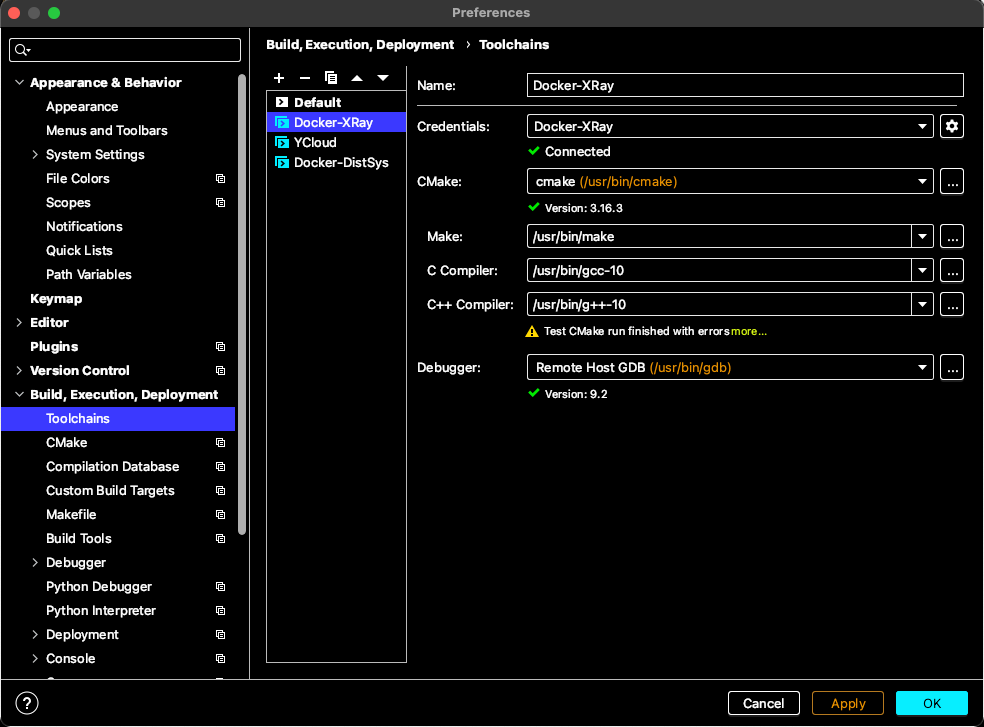
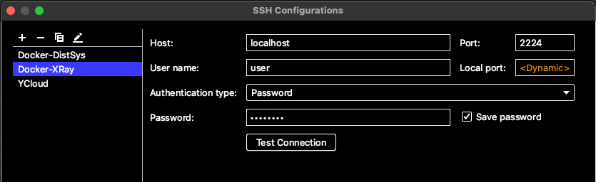
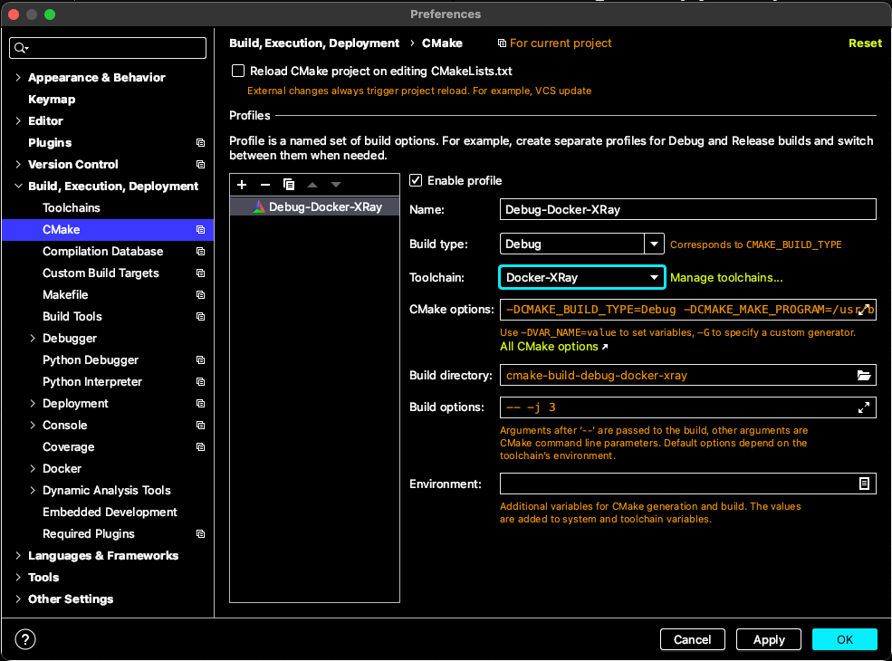

# Development container

## Install Docker

#### Linux:
```shell script
sudo apt install -y docker docker-compose bash
sudo groupadd docker
sudo usermod -aG docker $USER
```
Then start a new terminal session (or reboot the machine).

#### OS X:
Download and install [Docker Desktop](https://download.docker.com/mac/stable/Docker.dmg).

## Create container
Navigate to directory `xray-16/docker` and run the following to create 
container:
```shell script
bash create.sh
```

## Log in to container
In case you need to look around inside the container, run
```shell script
bash login.sh
```
Entire project is located inside `/xray-16/` directory.
Work with container under the same user as the one who created it.

## Exit from container
Simply run `exit`.

## Restart container
If you reloaded your machine or container somehow disappeared, run
```shell script
bash restart.sh
````

## Important notes
User `user` is used for integration with CLion, don't try to log in as him manually.

## CLion integration (optional)

#### References
- [Stay local, let your IDE do remote work for you!](https://blog.jetbrains.com/clion/2018/09/initial-remote-dev-support-clion/)
- [Full Remote Mode](https://www.jetbrains.com/help/clion/remote-projects-support.html)

#### Steps
- Make sure that container is running:
  ```
  docker container list | grep xray-dev
  ```
- In CLion:
    1. Open `xray-16` project
    2. In `Preferences/Settings` > `Build, Execution, Deployment` > `Toolchains`
       create Remote Host and fill paths to the tools (compiler, cmake and 
       so on) like on the screenshot below:
       
       ```
       username: user
       password: password
       ```
       

    3. In `Preferences/Settings` > `Build, Execution, Deployment` > `CMake` 
       choose `Toolchain` – created above Remote Host:

       

- You are good to go.
